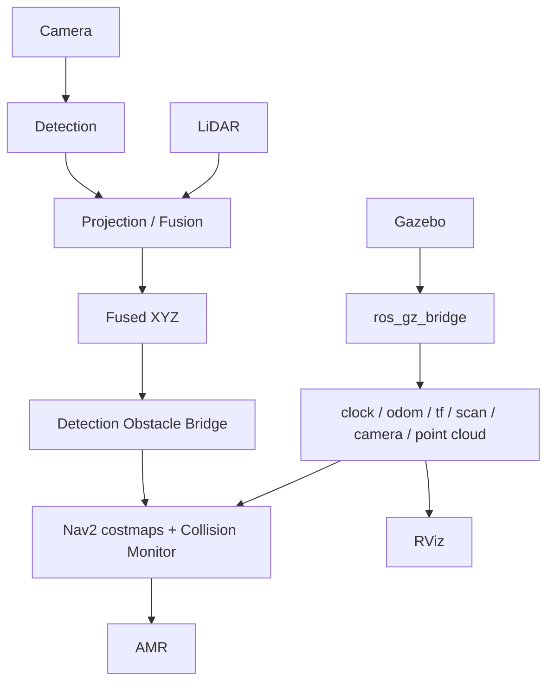

# Camera–LiDAR Fusion Navigation

[](https://github.com/DangTuyen0604/camera_lidar_fusion/actions/workflows/build-and-test.yml)
[](https://github.com/DangTuyen0604/camera_lidar_fusion/actions/workflows/lint.yml)

## 1. Project overview

ROS 2 project for an autonomous mobile robot (AMR) that combines camera
detections with LiDAR depth, transforms fused XYZ detections with TF2, and
publishes expiring obstacles to Nav2 costmaps and Collision Monitor. The
canonical demo runs the complete chain in Gazebo; KITTI playback is available
for offline calibration, projection, and perception experiments.

The final path is real message flow, not direct costmap injection:

`camera + LiDAR -> detection -> fusion -> obstacle bridge -> Nav2 -> AMR`

## 2. Architecture



The safety command chain is:

`controller_server -> /cmd_vel_nav -> velocity_smoother ->
/cmd_vel_smoothed -> collision_monitor -> /cmd_vel -> ros_gz_bridge -> Gazebo`

## 3. Package structure

| Package/directory | Responsibility |
|---|---|
| `fusion_interfaces` | Typed detection, fusion, sync, calibration, and metric messages |
| `kitti_ros2_player` | KITTI image/point-cloud playback, calibration, and static TF |
| `yolo_detector` | ONNX detector and deterministic simulation color detector |
| `perception_core` | Synchronization, projection, depth estimation, fused XYZ, and metrics |
| `navigation_bridge` | Validation, TF2 transform, obstacle footprint, timeout, and clearing |
| `navigation_bringup` | Localization, Nav2, costmaps, velocity smoother, Collision Monitor, RViz |
| `openamrobot_description` | Robot URDF/Xacro and TF links |
| `openamrobot_gazebo` | Gazebo robot spawn and ROS–Gazebo bridges |
| `warehouse_simulation` | Canonical warehouse world and simulated objects |
| `warehouse_mission_manager` | Warehouse mission utilities |
| `fusion_bringup` | Top-level perception and final demo launch files |
| `system_tests` | Behavioral and live launch tests |
| `benchmarks`, `experiments` | Reproducible metrics and deterministic fault results |

## 4. Requirements

- Ubuntu 24.04 (Noble), x86-64
- ROS 2 Jazzy Desktop
- Gazebo Harmonic through `ros_gz`
- Nav2, Collision Monitor, laser filters, TF2, OpenCV, Eigen, and yaml-cpp
- Python 3.12; the optional ONNX/KITTI tools use `requirements.txt`

Install system dependencies and the project Python environment:

```bash
./scripts/install_dependencies.sh
```

The script installs apt/rosdep dependencies and creates `.venv`. Do not source
`.venv` for normal ROS launch commands; it is intended for standalone tooling.

## 5. Build

From the repository root:

```bash
source /opt/ros/jazzy/setup.bash
rosdep install --from-paths src --ignore-src --rosdistro jazzy -r -y
colcon build --symlink-install
source install/setup.bash
```

For a reproducible clean build:

```bash
rm -rf build install log
source /opt/ros/jazzy/setup.bash
colcon build --symlink-install
source install/setup.bash
```

## 6. Run

Canonical one-command demo from a fresh terminal:

```bash
source /opt/ros/jazzy/setup.bash
source install/setup.bash
ros2 launch fusion_bringup final_demo.launch.py
```

This starts Gazebo, the robot, bridges, localization, Nav2, camera, LiDAR,
detector, fusion, obstacle bridge, metrics, and RViz. For CI/headless systems:

```bash
ros2 launch fusion_bringup final_demo.launch.py \
  use_rviz:=false gazebo_gui:=false
```

Optional KITTI projection demo:

```bash
./tools/download_kitti.sh
ros2 launch fusion_bringup projection_demo.launch.py use_rviz:=true
```

Optional ONNX perception demo expects `models/yolov8n-opencv.onnx`:

```bash
./scripts/run_perception_demo.sh
```

## 7. Topics

Canonical simulation interfaces:

| Topic | Type | Purpose |
|---|---|---|
| `/camera/image_raw` | `sensor_msgs/msg/Image` | Gazebo camera image |
| `/camera/camera_info` | `sensor_msgs/msg/CameraInfo` | Camera calibration |
| `/lidar/points` | `sensor_msgs/msg/PointCloud2` | Gazebo LiDAR cloud |
| `/fusion/synced/*` | Image, CameraInfo, PointCloud2 | Time-aligned sensor inputs |
| `/detections_2d` | `fusion_interfaces/msg/Detection2DArray` | Image detections |
| `/fusion/detections_3d` | `fusion_interfaces/msg/FusedDetectionArray` | Valid/invalid fused XYZ results |
| `/fusion/sync_status` | `fusion_interfaces/msg/SyncStatus` | Synchronization health and delay |
| `/fusion/metrics` | `fusion_interfaces/msg/PipelineMetrics` | Runtime perception metrics |
| `/navigation/detection_obstacles` | `sensor_msgs/msg/PointCloud2` | Bridge obstacles for Nav2 and Collision Monitor |
| `/navigation/detection_obstacles/clearing` | `sensor_msgs/msg/PointCloud2` | Costmap clearing rays after expiry |
| `/scan`, `/scan_filtered` | `sensor_msgs/msg/LaserScan` | Raw and robot-body-filtered scan |
| `/odom`, `/tf`, `/tf_static`, `/clock` | Standard ROS messages | Localization and simulation time |
| `/cmd_vel_nav` | `geometry_msgs/msg/Twist` | Controller output |
| `/cmd_vel_smoothed` | `geometry_msgs/msg/Twist` | Velocity smoother output |
| `/cmd_vel` | `geometry_msgs/msg/Twist` | Collision-checked command sent to Gazebo |

Inspect the live contract with `ros2 topic list -t` and
`ros2 topic info <topic> --verbose`.

## 8. TF tree

Canonical simulation tree:

```text
map
└── odom
    └── base_footprint
        └── base_link
            ├── lidar_link
            └── camera_link
                └── camera_optical_frame
```

Fused detections retain their source frame. The obstacle bridge looks up TF at
the detection timestamp and transforms them into `base_link`; it never assumes
a missing camera frame. Verify the live tree with:

```bash
ros2 run tf2_tools view_frames
ros2 run tf2_ros tf2_echo base_link camera_optical_frame
ros2 run tf2_ros tf2_echo base_link lidar_link
```

KITTI playback uses `velodyne -> camera_optical_frame` from the selected
calibration file.

## 9. Demo

The one canonical scenario localizes the AMR, sends a Nav2 goal, introduces a
physical simulated worker after motion begins, observes camera/LiDAR fusion,
slows or stops through Collision Monitor, expires the lost obstacle, and then
reaches the goal without collision.

Run it three times and save evidence:

```bash
source /opt/ros/jazzy/setup.bash
source install/setup.bash
python3 benchmarks/run_canonical_demo.py --runs 3
```

Results are written to `benchmarks/canonical_demo_results.json` and `.csv`.
The checked-in baseline records 3/3 consecutive successful runs with seed
`12012`.

## 10. Tests

```bash
source /opt/ros/jazzy/setup.bash
source install/setup.bash
colcon test --event-handlers console_direct+
colcon test-result --verbose
git diff --check
```

The suite includes behavioral tests for valid TF transforms, unknown frames,
stale/zero/future timestamps, invalid and non-finite detections, obstacle
expiry, synchronization thresholds, and a live final-launch smoke/interface
test. Optional dataset-dependent tests are skipped when KITTI is absent.

Latest clean verification: `296 tests, 0 errors, 0 failures, 34 skipped`.

## 11. Benchmark

Canonical Gate 12/13 metrics:

```bash
python3 benchmarks/run_canonical_demo.py --runs 3
```

The JSON/CSV output includes camera, point-cloud, detection, and fusion rates;
mean sync delay; goal duration; reaction latency; obstacle expiry; pipeline
latency; and minimum clearance. The current three-run mean is documented in
`benchmarks/canonical_demo_results.json`.

For the broader scenario matrix:

```bash
python3 benchmarks/run_benchmark.py
python3 benchmarks/plot_results.py
```

## 12. Fault injection

Run only the five implemented deterministic faults:

```bash
python3 benchmarks/run_core_faults.py --seed 12014
```

It measures timestamp delay, calibration perturbation, point-cloud noise,
density reduction, and lost detection/obstacle expiry. Results and the seed are
stored in `experiments/gate14_core_faults.json`; behavior is validated through
outputs and metrics rather than source-text assertions.

## 13. Known limitations

- The simulation detector is color-based and exists only for deterministic
  Gazebo testing; real images require the ONNX detector and a compatible model.
- KITTI tests require the separately downloaded dataset; they skip otherwise.
- Calibration is static during a run. The monitor reports degradation but does
  not perform online extrinsic recalibration.
- The bridge represents each detection as a class-sized point-cloud footprint,
  not a full 3D mesh or tracked object trajectory.
- Default stale and obstacle timeouts are 0.5 s and 0.75 s; deployments should
  tune them for sensor rate and braking distance.
- RViz may emit OpenGL/GLSL warnings or need forced shutdown on some remote or
  virtualized GPU sessions. Use `use_rviz:=false` for headless operation.
