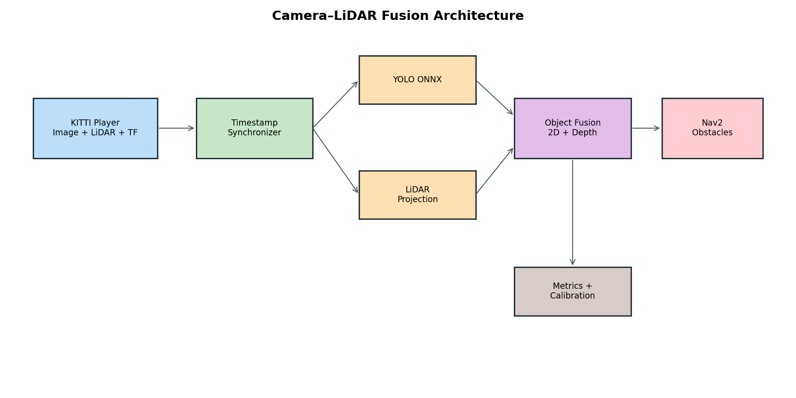

# Kiến trúc hệ thống

Pipeline gồm bốn tầng. `kitti_ros2_player` phát ảnh, CameraInfo, point cloud và
TF tĩnh. `sensor_sync_node` ghép ba luồng theo timestamp. `yolo_detector` chạy
ONNX và tạo `Detection2DArray`; `object_fusion_node` chiếu LiDAR vào bbox để tạo
`FusedDetectionArray`. `navigation_bridge` chuyển các detection hợp lệ thành
PointCloud2 để obstacle layer của Nav2 sử dụng.

Các message dùng chung nằm trong `fusion_interfaces`. Launch/config thuộc
`fusion_bringup` và `navigation_bringup`; kiểm thử liên package nằm trong
`system_tests`. Dữ liệu lớn và model không được commit vào Git.

Nguyên tắc thiết kế: timestamp của sensor được giữ nguyên, frame được kiểm tra
trước khi fusion, output không hợp lệ vẫn được publish với `valid=false`, và
mọi tham số runtime đều có thể thay bằng YAML.
